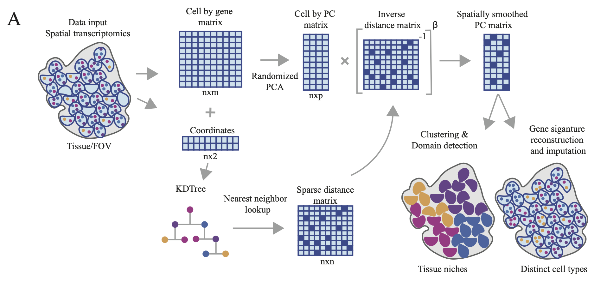

# Randomized Spatial PCA (RASP)




## Description

Here, we present Randomized Spatial PCA (RASP), a novel spatially aware dimensionality reduction method for spatial transcriptomics (ST) data. 
RASP is designed to be orders-of-magnitude faster than existing techniques, scale to ST data with hundreds of thousands of locations, support the 
flexible integration of non-transcriptomic covariates, and enable the reconstruction of de-noised and spatially smoothed expression values for individual genes. 
To achieve these goals, RASP uses a randomized two-stage principal component analysis (PCA) framework that leverages sparse matrix operations and configurable spatial smoothing.

## Features

- **High-Speed Performance**: RASP is optimized for fast processing of large spatial transcriptomics datasets.
- **Flexible Integration**: Seamlessly integrates non-transcriptomic covariates into the analysis.
- **Spatially Smoothed Values**: Produces reconstructed expression values that account for spatial context.
- **User-Friendly**: Designed to be accessible for researchers in spatial biology.

## Requirements

To run RASP, you need the following Python packages:
```
- numpy==1.26.4
- pandas==2.2.2
- scanpy==1.10.1
- squidpy=1.2.2
- matplotlib==3.8.4
- scipy==1.13.1
- sklearn==1.5.0
- rpy2=3.5.16
- igraph==0.11.5
```

## Installation
We are working on getting RASP up on anaconda. In the meantime, to install RASP from Github please clone the repo: 
```bash
git clone https://github.com/Goods-Lab//RASP.git
cd RASP
pip install . 
```
## Usage
See tutorials folder for example usage

## Citation
If you use RASP in your research, please cite the following preprint: https://www.biorxiv.org/content/10.1101/2024.12.20.629785v1
